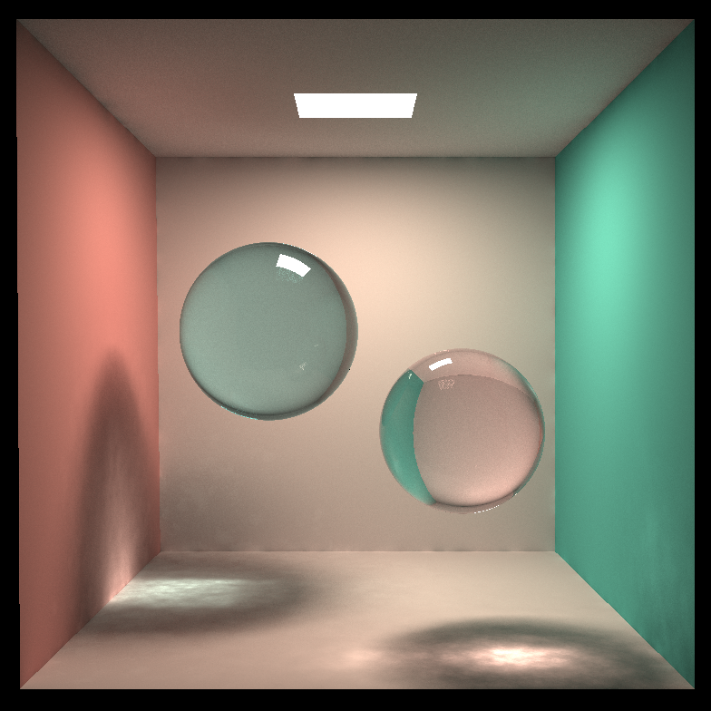
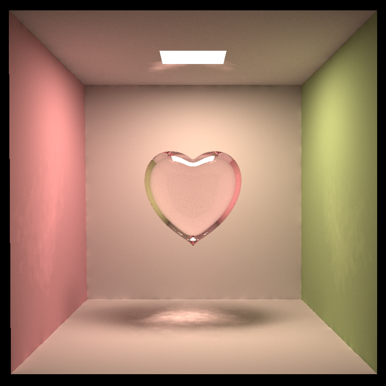

# Raytracer - with Photon Mapping

This project is based on the [GAMES101](https://sites.cs.ucsb.edu/~lingqi/teaching/games101.html) homework 7 raytracer. It is my GAMES101 final project! I have integrated basic photon mapping functionality into this raytracer, and build some simple scene (these figures use SSP 1024):

Although it is not perfect, but the caustics effect is lovely!

## What I have done...

For photon mapping:

* [X] Trace photons to diffuse object.
* [X] Define [specular reflection and transmission material model](https://www.pbr-book.org/3ed-2018/Reflection_Models/Specular_Reflection_and_Transmission#Fresnel-ModulatedSpecularReflectionandTransmission).
* [X] Store photons into left-balanced kd-tree photon map.
* [X] Draw a heart! (as Valentine's Day is around XD)
* [ ] Progressive photon mapping is still pending!

## Reference

* Framework

  * [GAMES101 homework](https://games-cn.org/forums/topic/allhw/) (in Chinese)
  * [GAMES101 framework guide](https://games-cn.org/forums/topic/games101-zuoye7-raokengyinlu-windows/) (in Chinese)
* Photon mapping

  * [Realistic Image Synthesis Using Photon Mapping](http://graphics.ucsd.edu/~henrik/papers/book/) (there is code reference, and I mainly follows this book)
  * [A Practical Guide to Global Illumination using Photon Maps](http://www.graphics.stanford.edu/courses/cs348b-01/course8.pdf) (a summary of Realistic Image Synthesis Using Photon Mapping)
  * [photonmapping lecture (princeton.edu)](https://www.cs.princeton.edu/courses/archive/fall16/cos526/lectures/03-photonmapping.pdf) (lecture note for photon mapping, I start from this)
  * [《全局光照技术：从离线到实时渲染》](https://thegibook.com/)(much easier than the PBR book, and in Chinese!)
  * [PBR book](https://www.pbr-book.org/3ed-2018/) (too hard for me...)
  * [光子映射总结（1/4）：基本全局光子映射（Basic Photon Mapping） - 知乎 (zhihu.com)](https://zhuanlan.zhihu.com/p/208356944) (useful summary!)
  * ... (lots of other notes form zhihu, CSDN, and github)
* Draw heart

  * [Explicit representation for a heart](http://mathworld.wolfram.com/HeartSurface.html)
  * [Shader toy heart](https://www.shadertoy.com/view/XtXGR8), [Another shader toy heart](https://www.shadertoy.com/view/XtVSRh)
  * [An Introduction to Raymarching | Maxime Garcia (typhomnt.github.io)](https://typhomnt.github.io/teaching/ray_tracing/raymarching_intro/) (I draw the heart with raymarching idea)
  * [数学图形之心形 - 叶飞影 - 博客园 (cnblogs.com)](https://www.cnblogs.com/WhyEngine/p/3885126.html)
